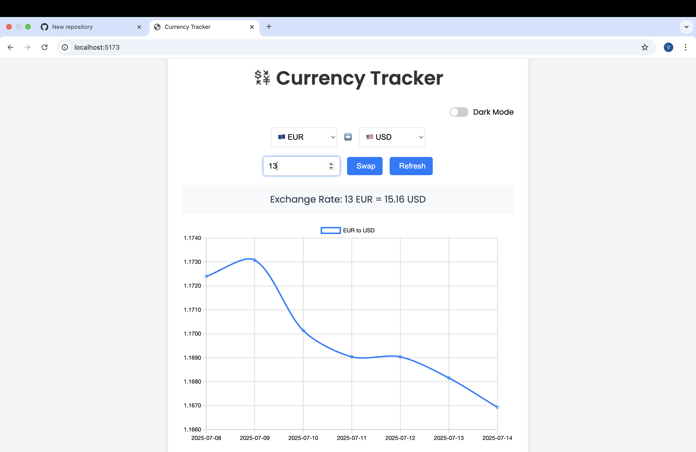
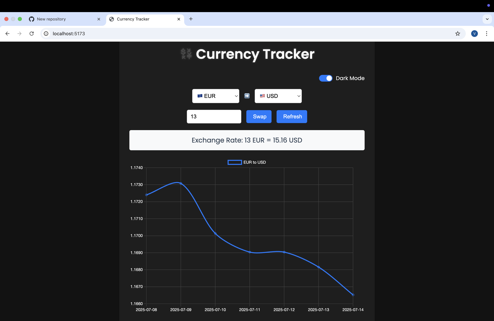

# 💱 Currency Tracker

A sleek and responsive currency converter web app that fetches **real-time exchange rates** and displays **historical trends** in an interactive chart. Includes modern UI with dark mode, currency swapping, and live updates.

---

## 📸 Screenshots

| 💡 Light Mode | 🌙 Dark Mode |
|--------------|-------------|
|  |  |

---

## 🚀 Features

- 🔄 Real-time currency conversion
- 📊 7-day historical exchange rate chart (via Chart.js)
- 🌙 Dark mode toggle
- 💰 Amount input for dynamic calculation
- 🔁 Currency swap button
- 🔃 Refresh exchange data
- 📱 Mobile-friendly responsive layout
- 🇺🇸 Flag icons with country codes in dropdowns
- ⚡ Smooth animations and clean design
- 🔐 Environment-protected API key with `.env`

---

## 🛠️ Tech Stack

- **Vite** (build tool)
- **JavaScript (ES6+)**
- **HTML5 + CSS3**
- **Chart.js** for graphs
- **Google Fonts** (`Poppins`)
- **Font Awesome** for icons
- **Fixer.io API** for exchange rates

---

## 📦 Getting Started

```bash
# 1. Clone the repo
git clone https://github.com/Vani21-ps/CurrencyTracker.git
cd CurrencyTracker

# 2. Install dependencies
npm install

# 3. Add your API key in a .env file
echo "VITE_API_KEY=your_api_key_here" > .env

# 4. Run the app
npm run dev
⚠️ Make sure your .env file is in the root folder and is listed in .gitignore to keep your key private.

🌍 Sample .env File
env
Copy code
VITE_API_KEY=your_api_key_here
🔐 API Used
Fixer.io – Real-time & historical foreign exchange rates

👩‍💻 Author
Vani Jain
🔗 LinkedIn
🐙 GitHub

⭐️ Show Some Love!
If you like this project, feel free to:

⭐️ Star the repo

🍴 Fork it

🐛 Report bugs

📢 Share with friends!
